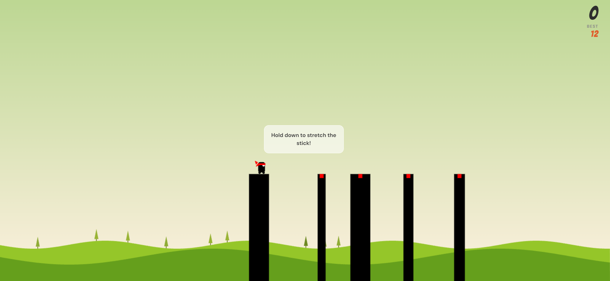

# 🎮 Stick Hero — Day 9 of 30

A JavaScript + HTML Canvas implementation of the classic Stick Hero game.



## 🕹️ How to Play

- **Hold** the mouse button (or tap and hold on mobile) to stretch the stick
- **Release** to drop it — if it reaches the next platform you move forward
- Hit the **red zone** in the center for **double score!**
- Press **Space** to restart at any time

## 🚀 Running the Game

Because this project uses ES Modules, you need to serve it over HTTP (not open as a file directly).

**Option 1 — VS Code Live Server:**
Right-click `index.html` → Open with Live Server

**Option 2 — Node http-server:**
```bash
npx http-server .
```

**Option 3 — Python:**
```bash
python3 -m http.server 8080
```

Then open `http://localhost:8080` in your browser.

## 📁 Project Structure

```
stick-hero/
├── index.html        # Entry point & HTML layout
├── css/
│   └── style.css     # All styles
└── js/
    ├── config.js     # Game constants & tuning values
    ├── state.js      # Shared game state
    ├── draw.js       # All canvas rendering logic
    ├── storage.js    # localStorage high score
    └── game.js       # Game loop, physics, events
```

## ✨ Improvements over original CodePen

| Feature | Original | This version |
|---|---|---|
| File structure | Single file | ES Modules (config / state / draw / game) |
| `Array.prototype.last` polyfill | Custom polyfill | Removed — uses native `.at(-1)` (ES2022) |
| High score | `// Todo` comment | ✅ Saved to localStorage |
| Touch support | ❌ Mouse only | ✅ touchstart / touchend added |
| Typography | Segoe UI | Bangers + DM Sans |
| Day badge | ❌ | ✅ Day 9 / 30 |

## 🛠️ Tech Stack

- **Vanilla JavaScript** (ES2022+, ES Modules)
- **HTML Canvas API**
- **CSS3**
- No frameworks, no dependencies

---

Original game concept by [Hunor Borbely](https://twitter.com/HunorBorbely)
